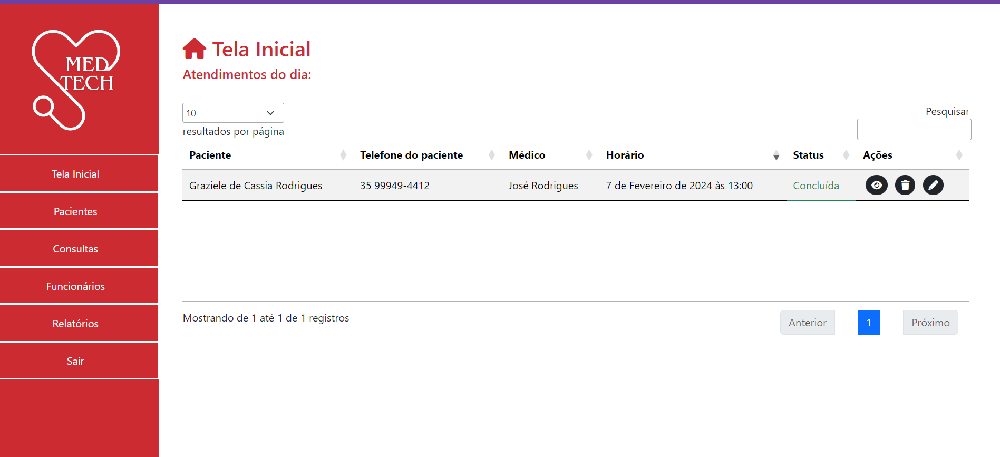
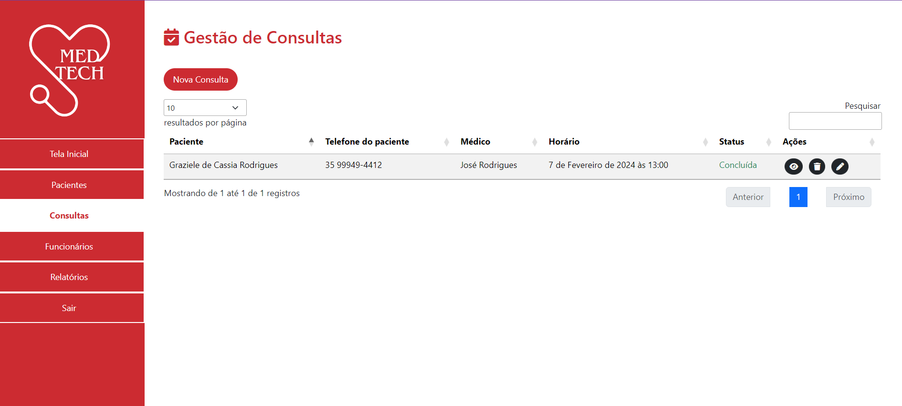
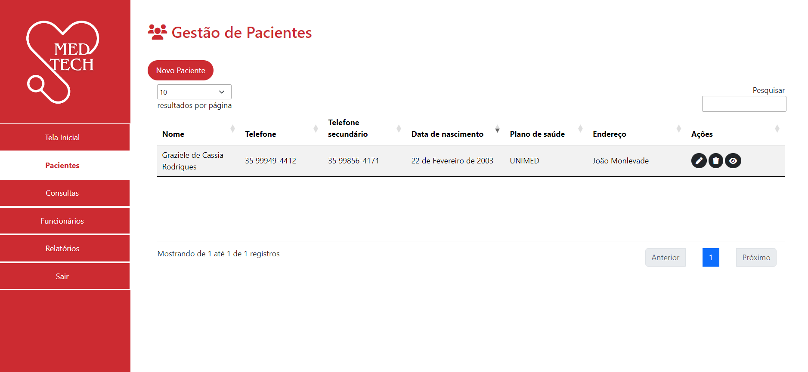
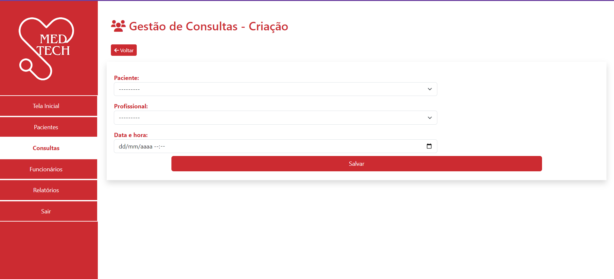
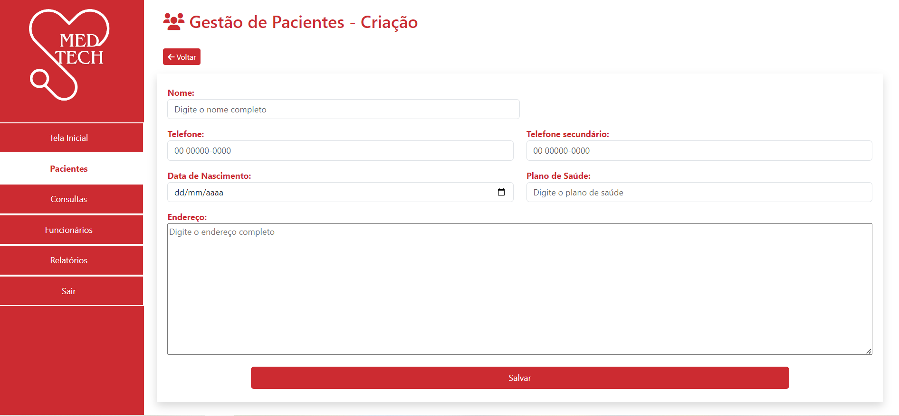
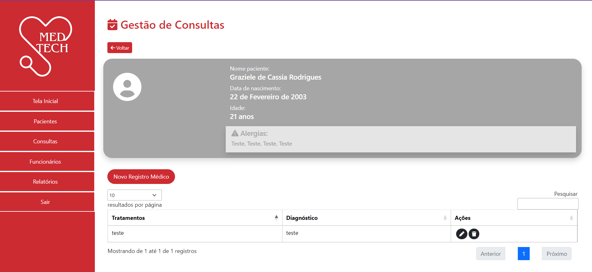
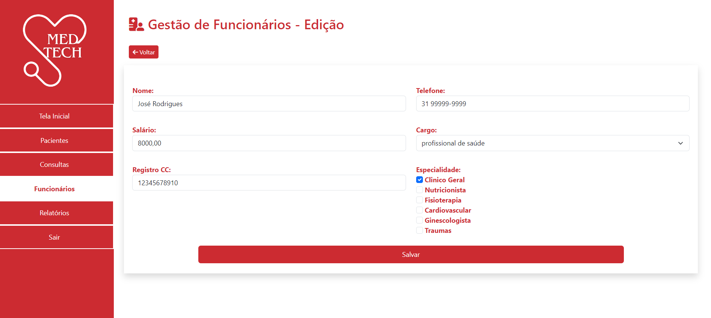
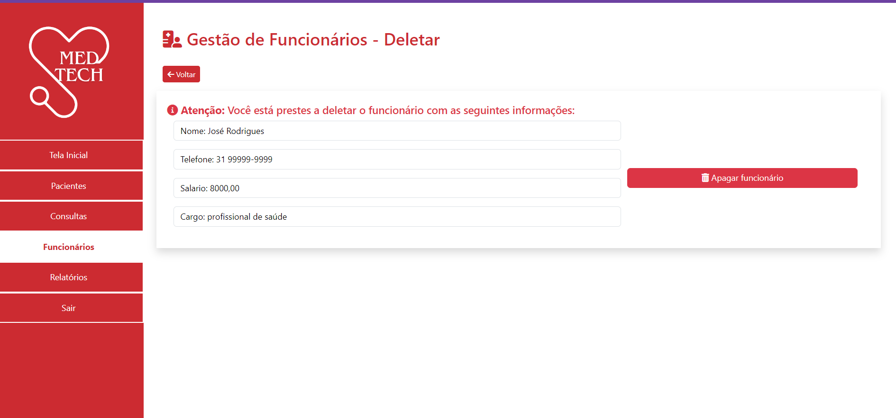
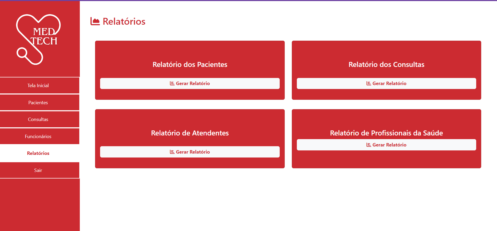

# Sistema de gerência clinica médica

Sistema para gerenciar um clinica médica, possibilitando, com facilidade, o cadastro de pacientes, consultas realizadas e acompanhamento médico. 

## 🚀 Descrição


### 📋 Pré-requisitos

1. VsCode ou outro editor como pycharm -  [Baixe vsCode aqui ](https://code.visualstudio.com/download)
2. python 3.x.x - [Baixe python aqui](http://www.sis4.com/brModelo/)
3. pip - pacote gerenciamento padrão

### 🔧 Instalação
1. Criar ambiente virtual de isolamento: 
Se Windows
```
$ python -m venv venv
```
2. Ativar Venv :

Se Windows
```
$ venv/Scripts/Activate 
```
Se Linux 
```
$ venv/bin/activate 
```

3. Instalação Django e demais componentes:

```
$ pip install -r requirements.txt 
```

4. Verifique se Django foi instalado com sucesso:
```
$ python -m django --version
```


## ⚙️ Executanando os testes e mostrando seus resultados


## 📦 Implantação

```
$ python manage.py makemigrations
$ python manage.py migrate
$ python manage.py createsuperuser
$ python manage.py runserver
```
# Telas da Aplicação













## 🛠️ Construído com

* [Django](https://www.djangoproject.com/) - Framework de desenvolvimento web em python


## ✒️ Autores

* **Graziele** - *Desenvolvedora* - [GitHub Graziele](https://github.com/Graziele-Rodrigues)
* **Laura** - *Desenvolvedora* -  [GitHub Laura](https://github.com/LauraMarques20)
* **Paulo** - *Desenvolvedor* - [GitHub Paulo](https://github.com/Paulolzms)
* **Pedro** - *Desenvolvedor* - [GitHub Pedro](https://github.com/pedrohvenancio)
* **Vinicius** - *Desenvolvedor* - [GitHub Vinicius](https://github.com/ViniHubb)


---
⌨️ com ❤️ por (Discentes Universidade Federal Ouro Preto) 😊